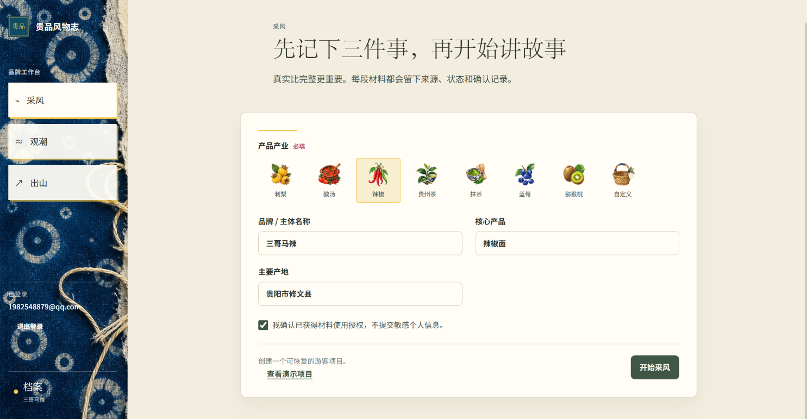
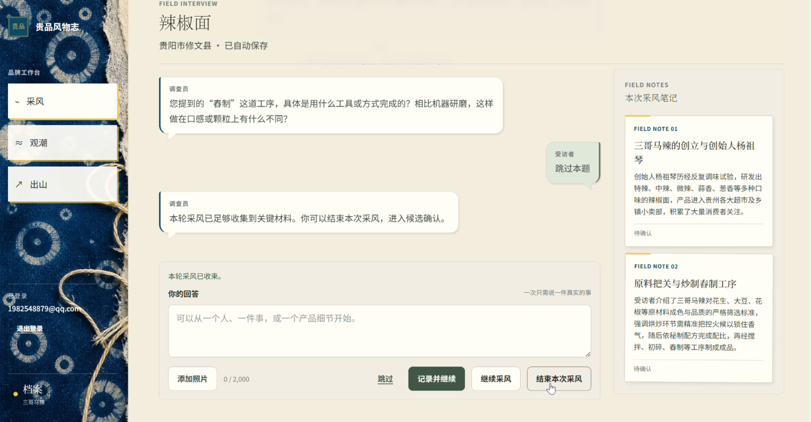
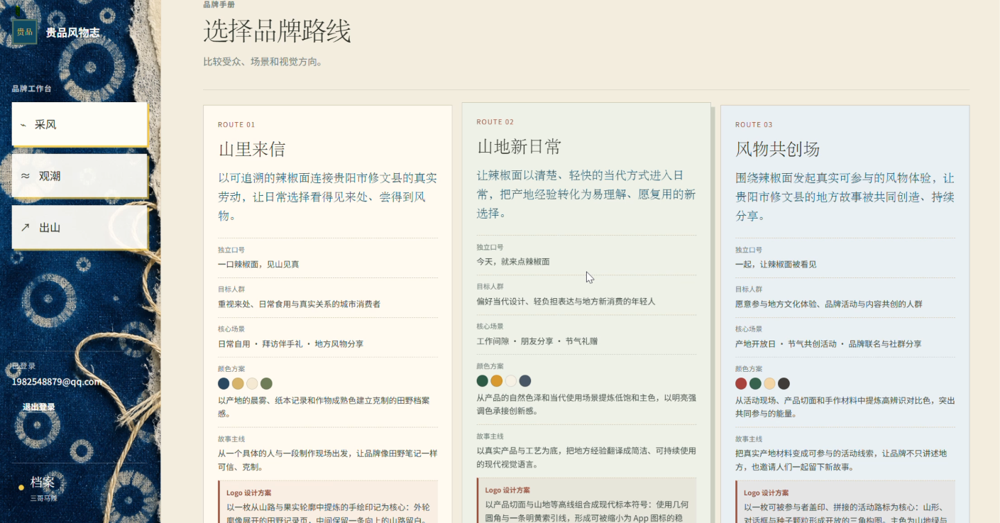
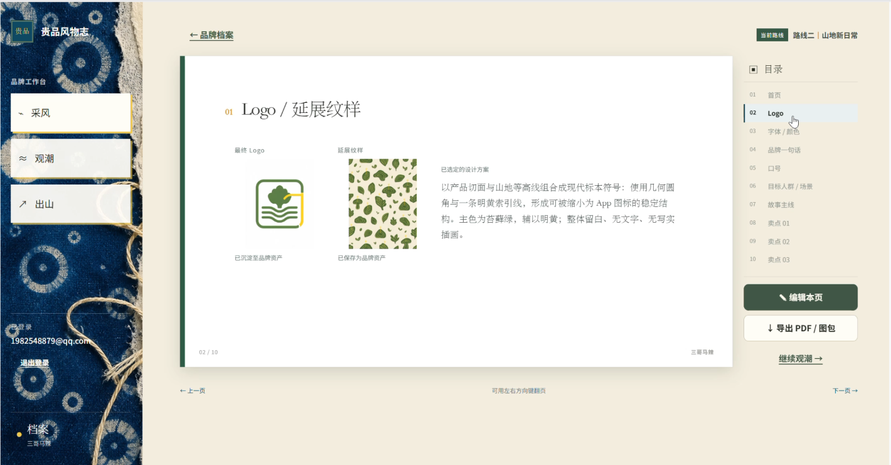
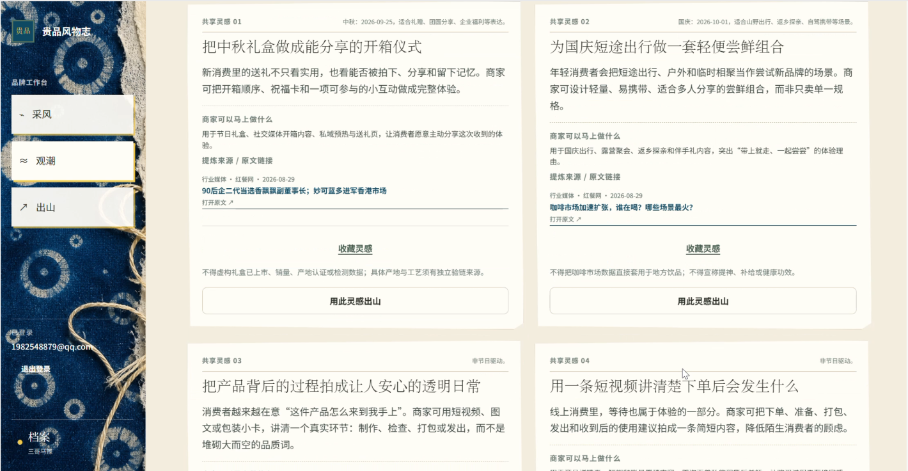
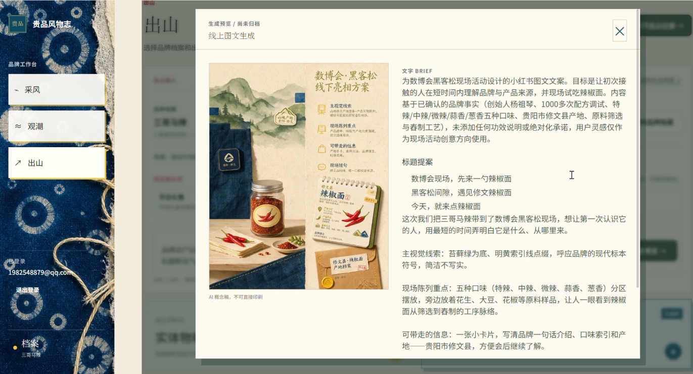

# 贵品风物志（MountainLore / 贵品风物志）

> 面向面向小微企业或个体（例如村集体运营者、厂二代和农产品主理人）的品牌档案工作台。将零散的真实输入整理为可确认的品牌档案，并基于选定的品牌方向，生成公开网络灵感与概念物料。

产品定义见 [PRD/贵品风物志：MVP 功能开发 PRD.md](PRD/贵品风物志：MVP%20功能开发%20PRD.md)

---

## 目录

- [项目简介](#项目简介)
- [核心流程](#核心流程)
- [功能特性](#功能特性)
- [界面截图](#界面截图)
- [技术架构](#技术架构)
- [目录结构](#目录结构)
- [快速开始](#快速开始)
- [配置说明](#配置说明)
- [测试](#测试)
- [部署](#部署)
- [设计系统](#设计系统)
- [相关文档](#相关文档)

---

## 项目简介

**贵品风物志**帮助面向小微企业或个体（例如村集体运营者、厂二代和农产品主理人）（刺梨、酸汤、辣椒、贵州茶、抹茶、蓝莓、猕猴桃等）完成从真实素材到品牌物料的完整闭环：
- **采风**：以对话式访谈收集产品、产地、人物与工艺的真实信息，支持文字与图片。
- **编志**：将零散素材沉淀为可逐张确认的候选档案，只有用户确认的档案才能进入下游。
- **定调**：基于已确认档案生成两版差异清晰的品牌路线，并产出可编辑的品牌手册。
- **观潮**：检索公开网络灵感，收藏或直接用于物料创作。
- **出山**：按模板生成概念物料（周边概念稿 / 小红书图文）。

系统默认运行在 **demo 演示模式**——无需任何外部密钥即可验证完整流程；配置密钥后切换为 **live 模式**，接入真实的模型、图像与搜索服务。所有异步能力失败时均保留已保存进度，绝不伪装成功。

---

## 核心流程

五步业务闭环，任何阶段离开后均从最后一个已完成状态恢复：

```text
扫码进入 → 选品 / 基础建档 → 采风 → 逐张确认候选档案 → 编志
        → 生成两版品牌路线并选择 → 观潮检索 / 选择灵感 → 出山生成物料
```

| 阶段 | 做什么 | 关键产物 |
|---|---|---|
| **采风** | Agent 逐问收集品牌起源、产品工艺、产地、人物与地方记忆，支持图片上传 | 结构化 FieldNote、本次采风笔记 |
| **编志** | 采风结束后生成候选档案卡，逐张确认或弃用；确认的档案可继续查看、编辑 | ArchiveCard（仅 active 档案可进入下游） |
| **定调** | 基于已确认档案生成两版品牌路线，比较后选择当前路线 | 品牌方向、品牌手册 |
| **观潮** | 按「核心产品 + 产地 + 当前路线」检索公开网络灵感 | 灵感卡（含来源、发布日期、风险提醒） |
| **出山** | 选择模板（周边概念稿 / 小红书图文），生成概念物料并支持重生成 | 生成任务与历史版本 |

> 侧栏主导航只展示「采风、观潮、出山」；编志与定调是采风完成后的自动连续步骤，档案是项目入口。详见 [frontend/AGENTS.md](frontend/AGENTS.md)。

---

## 功能特性

### 游客项目与额度（F-01）

- 扫码后无需登录，服务端下发 `visitor_token`（HttpOnly Cookie）创建匿名项目。
- 游客最多拥有一个未认领项目，7 天未认领自动过期删除。
- 游客配额：**2 次观潮搜索、2 套出山生成、同一出山任务额外重生成 1 次**，服务端原子校验并记录使用量。
- 刷新、断网或任务处理中重进，均可恢复项目、阶段与任务状态，不重复扣减额度。

### 采风（F-02）

- 首轮固定收集基础建档；之后 Agent 每次只问一个有信息增量的问题，总追问 2–3 次，可跳过。
- 文本最多 2,000 字；图片最多 5 张，仅用于 OCR 读图，先保存再作为附属素材。
- Agent 只挖掘用户说出的内容，绝不把用户未说出的内容写为事实。
- 每个话题收束后生成不可编辑的 FieldNote，实时展示笔记类型、编号、标题与摘要。
- 用户可随时「结束本次采风」，Agent 可建议但不得强制。

### 候选档案确认与编志（F-03）

- 采风结束后生成候选档案卡（产品、人物、产地、工艺、地方生活方式、品牌记忆、待核实线索）。
- 每张卡独立**确认 / 弃用**；弃用只丢弃该候选，不影响已保存笔记或项目。
- 已确认档案支持查看、新增、编辑与弃用；编辑带乐观锁（`content_version`），冲突时提示刷新。
- **只有已确认、未弃用的档案能够作为定调和出山的输入。**

### 定调与品牌手册（F-04）

- 编志完成后自动生成两版差异清晰的品牌方向，每版含候选品牌名、目标人群/场景、品牌一句话、卖点、故事主线、语气与视觉路线。
- 支持并排比较并选择一条为 `current`；重新生成创建新版本，旧版本可查看但不覆盖。
- 选择路线后自动生成**可编辑品牌手册**：品牌名、介绍、口号、人群/场景、故事主线、卖点与证据、视觉系统，以及无文字 Logo 图形方向、包装主视觉与延展纹样。
- 手册保存原始生成快照、当前编辑与不可变版本；可导出 **PDF / ZIP**，并可生成**不可撤销链接的不可变分享快照**（撤销后链接失效）。

### 观潮（F-05）

- 已选路线后按「核心产品 + 产地 + 当前路线/人群」检索公开网络，每次最多返回 2 张灵感卡。
- 灵感卡显示主题、内容母题、来源链接、发布日期（缺失则「时间未知」）、适配理由与风险提醒。
- 可收藏灵感，或点击「用这个灵感出山做物料」将灵感作为出山任务上下文。
- 搜索无结果、超时、配额耗尽或供应商失败时，展示「灵感正在积攒中」与重试入口，不伪造缓存或热榜。
- 每周一 09:00（中国时区）自动刷新共享的观潮周报；验链不足时保留上一期成功周报。

### 出山（F-06）

- 两种模板：**周边概念稿**（概念样机 + 文字 Brief）、**小红书图文**（封面/内容图 + 3 个标题 + 正文 + 推荐话题，默认 3:4 竖版）。
- 生成输入仅包括：当前路线、已确认档案、用户上传素材和可选灵感；弃用材料绝不进入输入快照。
- 每个任务保留输入快照、状态与产物；游客可额外重新生成一次。
- 无图像能力时仍交付可审阅的文字 Brief，并明确标注失败原因（`partial`），绝不使用预制图冒充生成。

### 登录与项目认领（F-07）

- 邮箱 + 密码登录（BCrypt 哈希，至少 8 位），HttpOnly 会话 Cookie（默认 30 天）。
- 首次注册/登录会把当前浏览器中尚未归属账号的匿名项目合并进该账号，跨设备恢复项目目录。
- 密码重置、邮箱验证、多因素认证与团队协作不在本期范围。

---

## 界面截图

> 截图占位。请将截图保存到 `PRD/screenshots/` 目录下（文件名可自行命名），并把下方路径替换为实际文件名即可。

| 界面 | 截图 |
|---|---|
| 欢迎 / 选品页（预置品类、自定义产品、隐私授权） |  |
| 采风访谈（对话式提问、图片上传、实时笔记） |  |
| 候选档案确认（逐张确认 / 弃用） |  |
| 品牌手册（类 PPT 视图） |  |
| 观潮：每周灵感与收藏 |  |
| 出山：生成结果与历史版本 |  |

---

## 技术架构

```text
浏览器（Next.js 前端, 端口 3000）
    │  同源 /api/* 服务端代理
    ▼
FastAPI 后端 (uvicorn, 端口 8000)
    ├─ 路由层：采风 / 编志 / 定调 / 观潮 / 出山 / 账号
    ├─ SQLite 持久化（data/mountainlore.db）
    ├─ 媒体与导出文件（data/media/）
    ├─ 异步任务执行器（queued → running → succeeded/failed，SSE 事件）
    └─ Provider 适配层（demo 本地演示 / live 真实服务）
         ├─ 文本 / 视觉模型（OpenAI 兼容）
         ├─ 图像模型（StepFun，3:4 竖版）
         └─ 观潮搜索（Tavily 检索 + Sonar 综合周报）
```

**技术栈**

| 端 | 技术 |
|---|---|
| 后端 | Python 3.12 · FastAPI · Uvicorn · SQLite · pydantic-settings · httpx · reportlab（PDF）· pypdf · bcrypt |
| 前端 | Next.js 16 · React 19 · TypeScript · Tailwind CSS 4 · ESLint |
| 部署 | Railway（前端公网 HTTPS + 后端私有网络 + 持久化 Volume） |

**关键设计原则**

- **统一响应信封**：写接口返回 `{ data, request_id }`；错误返回 `{ error: { code, message, field? }, request_id }`。服务端凭证永不返回前端。
- **幂等恢复**：写入与任务创建支持 `Idempotency-Key`，重复 key 返回同一任务；SSE 断开后客户端以任务 ID 重连或轮询，不重复创建或扣额。
- **事实边界**：只有 `ArchiveCard.status = active` 且 `Claim` 已确认、`public_allowed = true` 的事实可进入公开卖点。
- **降级不伪装**：模型/搜索/图像失败均保留已保存内容并明确标注状态，不存在伪造的缓存、热点或生成图。

---

## 目录结构

```text
MountainLore/
├── PRD/                        # 产品需求与开发计划文档
│   ├── 贵品风物志：MVP 功能开发 PRD.md
│   ├── 贵品风物志 P0 最小 MVP 开发计划.md
│   └── screenshots/            # 界面截图（占位，待补充）
├── backend/                    # FastAPI 后端
│   ├── app/
│   │   ├── main.py             # 应用入口、生命周期与中间件
│   │   ├── api/
│   │   │   ├── router.py       # 路由汇总
│   │   │   └── routes/
│   │   │       ├── fieldwork.py  # 账号、游客、采风、编志、上传
│   │   │       ├── workbench.py  # 定调、手册、观潮、出山、分享
│   │   │       └── health.py     # 健康检查
│   │   ├── core/config.py      # 环境配置（demo / live）
│   │   ├── fieldwork/store.py  # SQLite 数据层与迁移
│   │   └── services/           # Provider 适配、任务执行、观潮周报
│   ├── tests/                  # Pytest 测试
│   ├── data/                   # SQLite 与媒体文件（运行时生成）
│   ├── DATA_CONTRACT.md        # 数据模型与 API 契约
│   └── requirements.txt
├── frontend/                   # Next.js 前端
│   ├── src/
│   │   ├── app/                # 页面路由（含 /share/[token] 分享页）
│   │   ├── components/         # 工作台、采风、档案、手册等组件
│   │   └── lib/api.ts          # 后端 API 客户端
│   ├── public/guipin/          # 原型与贴纸资产（sticker-*.png）
│   ├── AGENTS.md               # 前端开发约束（设计权威、导航约定）
│   └── package.json
├── deploy/railway/             # Railway 部署说明与环境变量模板
├── DESIGN.md                   # 设计系统（配色、字体、组件准则）
└── README.md
```

---

## 快速开始

### 1. 启动后端（FastAPI）

```powershell
cd backend
# 使用 Conda（推荐）
conda create -n mountainlore-api python=3.12 -y
conda activate mountainlore-api
python -m pip install --upgrade pip
python -m pip install -r requirements.txt -i https://pypi.org/simple

# 或使用 venv
# python -m venv .venv && .\.venv\Scripts\Activate.ps1

python -m uvicorn app.main:app --reload --host 0.0.0.0 --port 8000
```

- API 地址：`http://localhost:8000`
- 交互文档（OpenAPI）：`http://localhost:8000/docs`
- 健康检查：`GET /api/health`

### 2. 启动前端（Next.js）

```powershell
cd frontend
npm install
npm run dev
```

打开 `http://localhost:3000` 即可使用。前端通过服务端同源代理 `/api/*` 转发到后端，浏览器不会直接接触后端地址。

> 首次运行时，建议先配置 `backend/.env`（复制 `.env.example` 为 `.env`）。

---

## 配置说明

后端配置集中在 `backend/.env`（模板见 [backend/.env.example](backend/.env.example)），由 `app/core/config.py` 统一加载。

### 运行模式

| 配置 | 说明 |
|---|---|
| `AI_RUNTIME_MODE=demo`（默认） | 本地演示模式，无需任何密钥即可走通全流程；生成内容明确标注「本地整理 / 概念 Brief」 |
| `AI_RUNTIME_MODE=live` | 接入真实服务，需配置下方各类密钥 |

### 供应商配置（live 模式）

| 变量 | 用途 |
|---|---|
| `OPENAI_NEXT_BASE_URL` / `OPENAI_NEXT_API_KEY` / `OPENAI_NEXT_TEXT_MODEL` | 采风、编志、定调、手册与视觉理解的文本模型 |
| `OPENAI_NEXT_JSON_MODE` | 文本模型的 JSON 对象约束，默认 `true`；仅在兼容网关明确不支持 `response_format` 时设为 `false` |
| `OPENAI_NEXT_IMAGE_BASE_URL` / `OPENAI_NEXT_IMAGE_API_KEY` / `OPENAI_NEXT_IMAGE_MODEL` | 图片生成（默认 StepFun，竖版 3:4） |
| `TIDE_API_KEY` / `TAVILY_API_KEY` / `TIDE_SEARCH_PROVIDER` | 观潮周报的检索与综合（Sonar + Tavily） |
| `TIDE_REFRESH_INTERVAL_SECONDS` | 观潮周报后台刷新间隔 |

其余常用配置：`DATABASE_PATH`、`MEDIA_DIRECTORY`、`MAX_UPLOAD_BYTES`（默认 10MB）、`AUTH_SESSION_TTL_DAYS`（默认 30 天）、`AUTH_COOKIE_SECURE`（生产 HTTPS 必须为 `true`）。

> **密钥只保留在服务端。** `GET /api/provider/readiness` 只返回逐能力配置状态与模型名，绝不返回密钥。

---

## 测试

后端使用 Pytest，测试覆盖游客恢复与单项目限制、上传校验、追问轮次、候选确认/弃用、档案编辑、路线版本、额度与幂等、任务恢复、Provider 成功/超时/失败及权限隔离等。

```powershell
cd backend
python -X utf8 -m pytest -q
```

前端质量检查：

```powershell
cd frontend
npm run lint -- --quiet
npx tsc --noEmit
npm run build
```

---

## 部署

项目按 Railway **两个服务**部署，仅前端获得公网 HTTPS 域名，后端留在私有网络内。

```text
Internet → frontend (Next.js, 公网) → backend (FastAPI, 私有网络) → /app/data Volume
```

1. **后端服务**：Root Directory 设为 `backend`，添加挂载在 `/app/data` 的 Volume，填入 [deploy/railway/backend.env.example](deploy/railway/backend.env.example) 中的变量（生产环境 `AUTH_COOKIE_SECURE=true`，密钥用 Railway 密封变量保存），**不生成公网域名**。
2. **前端服务**：Root Directory 设为 `frontend`，变量填写 `BACKEND_API_URL`（指向后端服务名），并生成前端公网域名。该 HTTPS 地址即分享给访客的入口。
3. **验证**：部署后创建项目并上传图片 → 重启后端 → 刷新前端确认项目与图片仍在；注册登录后确认匿名项目被认领。

> **公开 live 模式前请注意**：`AI_RUNTIME_MODE=live` 会让任何拿到公网链接的访客触发生成费用。公开冒烟测试请保持 demo 模式；开启 live 前应先加访问门禁或限流。

详见 [deploy/railway/README.md](deploy/railway/README.md)。

---

## 设计系统

界面遵循「地方档案册」的纸张与墨色体系，视觉基准见 [DESIGN.md](DESIGN.md)：

- **暖纸**（`#F2EDDE`）承载主画布与信息；**靛蓝**（`#0F4A63`）用于导航与主行动；**苔藓绿**（`#68755A`）表达归档、完成与来源；**明黄**（`#F1C84B`）承担「看这里」的标记职责；**玫瑰红**（`#C74657`）仅用于编号、批注与风险。
- 文字层级：标题用宋体（Noto Serif SC），正文用无衬线（Noto Sans SC），正文阅读宽度约 680–720px。
- 复用 `frontend/public/guipin/assets/` 下的手绘贴纸（刺梨、茶、辣椒、酸汤、蓝莓、猕猴桃、抹茶、自定义）作为产品识别素材。
- **禁用**：蓝紫渐变、玻璃拟态、霓虹科技面板、大圆角胶囊 UI、旅游宣传式 Hero Banner，以及没有来源说明的「纪实」图片。

---

## 相关文档

| 文档 | 说明 |
|---|---|
| [PRD/贵品风物志：MVP 功能开发 PRD.md](PRD/贵品风物志：MVP%20功能开发%20PRD.md) | 产品需求：目标、范围、流程、功能需求（F-01~F-07）、状态机、API、验收用例 |
| [PRD/贵品风物志 P0 最小 MVP 开发计划.md](PRD/贵品风物志%20P0%20最小%20MVP%20开发计划.md) | P0 范围、关键实现、接口约束与质量门槛 |
| [backend/DATA_CONTRACT.md](backend/DATA_CONTRACT.md) | 数据模型与 API 契约（闭环、接口表、模型适配、本地验证） |
| [DESIGN.md](DESIGN.md) | 设计系统规范（配色 Token、排版、组件、贴纸资源） |
| [frontend/AGENTS.md](frontend/AGENTS.md) | 前端工程约束（导航约定、设计权威、验收要求） |
| [deploy/railway/README.md](deploy/railway/README.md) | Railway 双服务部署说明 |
